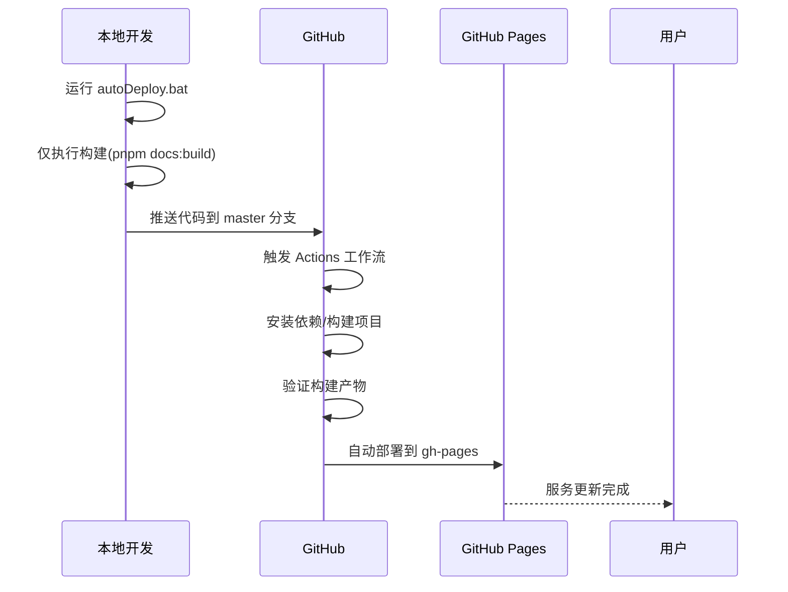
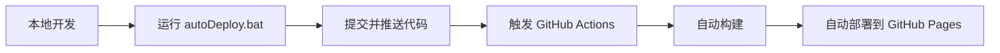

## 环境
  - node -v 18以上
  - node -v 18以上

## mermaid集成图表

## 时间先

::: timeline 2023-04-24
- 一个非常棒的开源项目 H5-Dooring 目前 star 3.1k
  - 开源地址 https://github.com/MrXujiang/h5-Dooring
  - 基本介绍 http://h5.dooring.cn/doc/zh/guide/
- 《深入浅出webpack》 http://webpack.wuhaolin.cn/
:::

::: timeline 2023-04-23
:::

